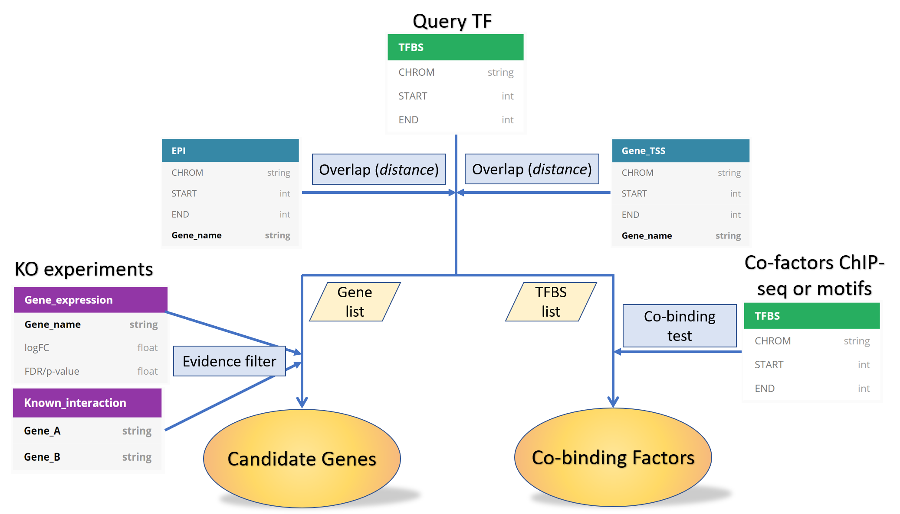

# Background

A common down-stream analysis of ChIP-seq peaks (or more generally, a set of cis-regulatory elements) is to find their target genes. However, assigning distal regulatory elements to their correct target genes is not an easy problem. Systematic comparison of several target gene assignment algorithms based on real promoter capture-C or HiC has found that the `best-performing method is only modestly better than a baseline distance method for most benchmark datasets`, suggesting that the most confident assignment should be still based on real experiments.

Therefore, our `TF_target_finder` pipeline uses promoter-enhancer interactions from promoter capture-C or HiC datasets and outputs a list of high-confidence assignments using differentially expressed genes from WT.vs.KO datasets.

# Terminology

1. Query set: it is a list of input ChIP-seq peaks or a list of cis-regulatory elements. Target genes will be assigned to each region in the query set.

2. Evidence set: biological evidence (based on real experiments, e.g., capture-C, RNA-seq, ChIP-seq, ATAC-seq) used to filter target gene assignments, resulting in a high-confidence subset of query set with assigned genes.

# Method

In this section, we describes the method to identify (1) direct targets and (2) co-binding factors.

## TF Target Finder

The `TF_target_finder` pipeline uses two types of biological evidence for target gene assignment, namely (Bio-1) enhancer-promoter interactions (EPI) from promoter capture-C or HiC and (Bio-2) query-set-associated differentially expressed genes from RNA-seq. It also integrates common accepted nearest gene assignment method as a soft-assignment method. In addition, it checks if query set occurs in a gene promoter region defined by `TSS_flank=5kb` parameter as a hard-assignment method. 

Hard-assignment simply means that if a query region occurs in gene A's promoter, then in addition to the target genes found by (Bio-1), gene A will be assigned to that query region.

Soft-assignment means that only if no target genes are assigned to the query region, then its nearest gene (based on TSS annotation) will be assigned to that query region.

By default, soft-assignment is on, users have the option to turn it off.

Using (Bio-1, hard and soft assignments), we can have all candidate assignments (output file: `*.query.targets_all.bed`). Using (Bio-2), we can have high-confidence candidate assignments (output file: `*.query.DEG_targets_filter.bed`). 

## TF Co-Binding Factor Finder

The `co_binding_test.py` program evaluates the significance of number overlaping regions based on (1) query set (2) query background set (3) co-binding factor set using Chi-square test. Co-binding test can be performed at both ChIP-seq peak level and TF motif level. For significant co-binding factors, both levels should have a significant p-value, however, depending on TF motif quality, users may just focus on ChIP-seq peak level.

# Dependencies

1. Pandas v1.0.3

2. Bedtools v2.29.1

3. MEME v4.11.2


# Input


# Output


# Usage

1. Find direct target

```
python assign_targets.py -q data/example_query.bed -tss data/mm9.ensembl_v67.TSS.gene_name.bed -epi data/captureC.HSC.mm9.bed -exp example/results.KO_vs_WT.txt --conservative
```

In (2) and (3), the input becomes the subset of query set (i.e., those with direct targets assigned)

2. Co-binding test for two chip-seq peaks

```
python co_binding_test.py -f1 data/example_query.bed -f2 data/416B/GSM1708650_Erg_416B.mm9.bed -d 500 -bg data/example_query_all.bed
```

3. co-binding test for two TF motifs in the query set

```

motif_scanning_flank=200

# query TF motif scanning on all peaks


python motif_scanning.py -f data/example_query_all.bed -m data/NFIX_mouse_known_motifs.meme -o NFIX_motif.BG.match.bed -e $motif_scanning_flank 

# query TF motif scanning on subset peaks

python motif_scanning.py -f data/example_query.bed -m data/NFIX_mouse_known_motifs.meme -o NFIX_motif.FG.match.bed -e $motif_scanning_flank

python motif_scanning.py -f data/example_query.bed -m data/mouse_TF.meme -o FLI1_motif.match.bed -e $motif_scanning_flank --motif_ids FLI1_MOUSE.H11MO.0.A

python co_binding_test.py -f1 NFIX_motif.FG.match.bed -f2 FLI1_motif.match.bed -d 200 -bg NFIX_motif.BG.match.bed

```
# Workflow




